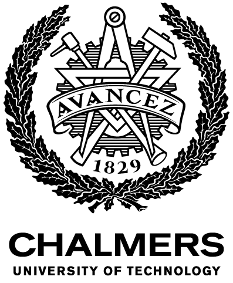
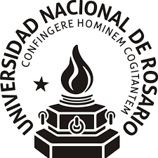

# About me

I'm PhD student at the Computer Science and Engineering department of [Chalmers
University of Technology](https://chalmers.se) in Sweden, under the supervision
of [Alejandro Russo](http://www.cse.chalmers.se/~russo). Previously, I received
a Licentiate Degree in Computer Science at the [National University of
Rosario](https://unr.edu.ar) in Argentina.

My research interests lie in the intersection of functional programming and
software security. In particular, I'm interested in developing automatic testing
tools, exploiting the statically known information of strongly typed, functional
languages like Haskell.

I'm a part of the [Octopi](https://octopi.chalmers.se) project, a platform for
secure programming IoT devices using functonal programming. Additionally, I'm a
collaborator of [QuickFuzz](https://github.com/CIFASIS/QuickFuzz), an
experimental grammar fuzzer written in Haskell that discovered a bunch of
zero-day vulnerabilities on web browsers and image processing libraries, among
other.

I also really enjoy cooking and trying new food whenever possible. If there is
something I miss from Argentina if we speak of food, they are definetely the
[achuras](../assets/img/achuras.jpg).

