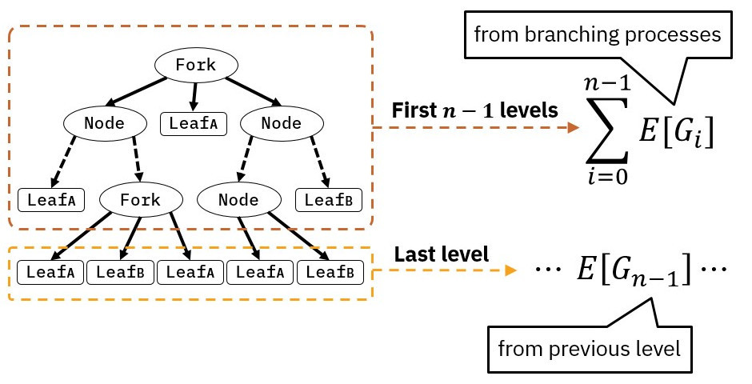

Random property-based testing (or random testing for short) is nothing new, yet
it is still a quite hot research field with many open problems to dig into. In
this post I will try to give a brief explanation of our [latest
contribution](../publications/bp.html) on random testing published in the
proceedings of the 2018 Haskell Symposium, as well as some use cases of
[**DRAGEN**](http://hackage.haskell.com/packages/dragen), the tool we
implemented to automate the boring stuff of using random testing in Haskell.

The key idea of random testing is pretty simple: you write the desired
properties of your system as predicates, and try to falsify them via randomly
generated test cases. Despite there are many, many libraries that provide this
functionality, implemented for a bunch of programming languages, here we will
put the spotlight over QuickCheck in Haskell. QuickCheck is the most prominent
tool around, originally conceived by Claessen and Hughes almost twenty years
ago. If you haven't heard of it, I strongly recommend checking the [original
paper](https://dl.acm.org/citation.cfm?id=351266) but, being more realistic, if
you're reading this you likely know about QuickCheck already.

In this post I will focus on using QuickCheck as a [fuzzing
tool](https://en.wikipedia.org/wiki/Fuzzing). Essentially, fuzzing is a
penetration testing technique that involves running a target program against
broken or unexpected inputs, asserting that they're always handled properly. In
particular, I'll show you how to use existing Haskell data types as "lightweight
specifications" of the input format of external target programs, and how we can
rely on meta-programming to obtain random data generators for those formats
automatically. In the future, the [Octopi](http://octopi.chalmers.se) project
will apply this technique to evaluate and improve the security of IoT devices.

## QuickCheck + fuzzing = 🎔

Software fuzzing is a technique that tries to reduce the testing bias by
considering the target program as a black-box, meaning that we can only evaluate
its correctness based on the outputs we obtain from the inputs we use to test
it.

This black-box fashion of testing forces us to express our testing properties
using a higher level of abstraction. For instance, one of the most general
properties that we can state over any external program consists in checking for
succesful termination, regardless of the inputs we provide it. We can express
such property in QuickCheck as follows:

```{.haskell}
prop_run :: Arbitrary t => String -> (t -> ByteString) -> t -> Property
prop_run target encode testcase = monadicIO $ do
  exitCode <- run $ shell target $ encode testcase
  assert (exitCode == ExitSuccess)

shell :: String -> ByteString -> IO ExitCode
shell cmd stdin = do
  (exitCode, _, _) <- readProcessWithExitCode cmd [] stdin
  return exitCode
```

From the previous property, we can observe that we need a couple of things in
order to test it:

1. A shell command `target` to execute.
2. A data type `t` describing the structure of the inputs of our target program.
3. A random generator for `t`, here satisfied by the `Arbitrary t` constraint.
4. A function `encode :: t -> ByteString` to transform our randomly generated
   Haskell values into the syntactic representation of the standard input of our
   target program.

Aditionally, note that here we decided to use the standard input of our target
program as interface, but nothing stops us from saving the test case into a file
and then running the target program using its filepath. In both cases, the idea
is essentially the same.

Then, we can test for instance that the unix
[`sort`](https://en.wikipedia.org/wiki/Sort_(Unix)) utility always terminates
successfully when we run it with randomly generated `Int`s. The first step is to
define an encoding function from `[Int]` to `ByteString`:

```{.haskell}
-- We simply put every number in a diferent line
encode :: [Int] -> ByteString
encode ints = ByteString.fromString . unlines . map show
```

The next requirement is to have a random generator for `[Int]`. Fortunately,
this is already provided by QuickCheck in the following `Arbitrary` instances:

```{.haskell}
instance Arbitrary Int
instance Arbitrary a => Arbitrary [a]
```

With both things in place, we can check that we generate and encode our data in
the right way in order to call `sort`:

```{.haskell}
ghci> encode <$> generate arbitrary >>= ByteString.putStr
-16
19
-28
-16
9
26
2
9
9
```

Finally, we can simply test `sort` by calling:

```{.haskell}
ghci> quickCheck $ prop_run "sort" encode
+++ OK, passed 100 tests.
```

In many scenarios, it might also be interesting to use an external fuzzer to
corrupt the generated `ByteString`s before piping them to our target program,
looking for bugs related to the syntactic representation of its inputs. For
instance, we could consider using the deterministic bit-level fuzzer
[_zzuf_](http://caca.zoy.org/wiki/zzuf) from _caca labs_:

```{.bash}
$ echo "hello world" | zzuf
henlo world
$ echo "int foo() { retun 42; }" | zzuf --ratio 0.02
int goo() { return 22; }
```

Then, we can modify our original property `prop_run` in order to run _zzuf_ in
the middle to corrupt the randomly generated test cases:

```{.haskell}
zzuf :: ByteString -> IO ByteString
zzuf stdin = do
  (_, stdout, _) <- readProcessWithExitCode "zzuf" [] stdin
  return stdout

prop_run_zzuf :: Arbitrary t => String -> (t -> ByteString) -> t -> Property
prop_run_zzuf target encode testcase = monadicIO $ do
  exitCode <- run $ shell target <=< zzuf $ encode testcase
  assert (exitCode == ExitSuccess)
```

Which will produce corrupted outputs like:

```{.haskell}
ghci> encode <$> generate arbitrary >>= zzuf >>= ByteString.putStr
-18
-19
3:�
-02*39$34
30
22
-:)
"9
;y
```

As simple as this testing method sounds, it turns out it can be quite powerful
in practice, and it's actually the main idea behind
[QuickFuzz](https://github.com/CIFASIS/QuickFuzz), a random fuzzer that uses
existing Haskell libraries under the hood to find bugs in a complex software,
spanning a wide variety of file formats.

Moreover, given that QuickCheck uses a type-driven generational approach, we can
exploit Haskell's powerful type system in order to define abstract data types
encoding highly-strutured data like, for instance, well-scoped source code,
finite state machines, stateless communication protocols, etc. Such data types
essentially act as a lightweight grammar of the input domain of our target
program. Then, we are required to provide random generators for such data types
in order to use them with QuickCheck, which is the topic of the next section.

## Random generators for custom data types

In the previous example, I've shown you how to test an external program easily,
provided that we had a QuickCheck random generator for the data type encoding
the structure of its inputs. However, if we are lucky enough to find an existing
library providing a suitable representation for the inputs of our particular
target program, as well as encoding functions required, then it's rarely the
case for such library to also provide a random generation for this
representation that we could use to randomly test our target program. The only
solution in this case is, as you might imagine, to provide a random generator by
ourselves or, as I'm going to show you by the end of this post, to derive it
automatically!

As I've introduced before, whenever we want to use QuickCheck with user-defined
data types, we need to provide a random generator for such data type. For the
rest of this post I will use the following data type as a motivating example,
representing 2-3 trees with two different kinds of leaves:

~~~{.haskell}
data Tree
  = LeafA
  | LeafB
  | Node Tree Tree
  | Fork Tree Tree Tree
~~~

The easiest way of generating values of `Tree` is by providing an instance of
QuickCheck's `Arbitrary` type class for it:

~~~{.haskell}
class Arbitrary a where
 arbitrary :: Gen a
 ...
~~~

This ubiquitous type class essentially abstracts the overhead of randomly
generating values of different types by overloading a single value `arbitrary`
that represents a monadic generator of `Gen a` for every type `a` we want to
generate. That said, we can easily instantiate this type class for `Tree` very
easily:

~~~{.haskell}
instance Arbitrary Tree where
 arbitrary = oneof
   [ pure LeafA
   , pure LeafB
   , Node <$> arbitrary <*> arbitrary
   , Fork <$> arbitrary <*> arbitrary <*> arbitrary
   ]
~~~

This last definition turns out to be quite idiomatic using the `Applicative`
interface of `Gen`. In essence, we specify that every time we generate a random
`Tree` value, we do it by picking with uniform probability from a list of random
generators using QuickCheck's primitive function `oneof :: [Gen a] -> Gen a`.
Each one of these sub-generators is specialized in generating a single
constructor of our `Tree` data type. For instance, `pure LeafA` is a generator
that always generates `LeafA`s, while `Node <$> arbitrary <*> arbitrary` is a
generator that always produce `Node`s, "filling" their recursive fields with
random `Tree` values obtained by recursively calling our top-level generator.

As simple as this sounds, our `Arbitrary Tree` instance is able to produce the
whole space of `Tree` values, which is really good, but also really bad! The
problem is that `Tree` is a data type with an infinite number of values. Imagine
picking `Node` constructors for every subterm, forever. You end up being stuck
in an infinite generation loop, which is something we strongly want to avoid
when using QuickCheck since, in principle, we want to test finite properties.

The "standard" solution to this problem is to define a "sized" generation
process which ensures that we only generate finite values. Again, QuickCheck has
a primitive for this called `sized :: (Int -> Gen a) -> Gen a` that let us
define random generators parametrized over an `Int` value known as the
_generation size_, which is an internal parameter of the `Gen` monad that is
threaded on every recursive call to `arbitrary`, and that can be set by the
user. Let's see how to use it to improve our previous definition:

~~~{.haskell}
instance Arbitrary Tree where
 arbitrary = sized gen
   where
     gen 0 = oneof
       [ pure LeafA
       , pure LeafB
       ]
     gen n = oneof
       [ pure LeafA
       , pure LeafB
       , Node <$> gen (n-1) <*> gen (n-1)
       , Fork <$> gen (n-1) <*> gen (n-1) <*> gen (n-1)
       ]
~~~

In this previous definition we establish that, every time we generate a `Tree`
value, we first obtain the current generation size by calling `sized`, and then
we branch into two different generation processes based on it. In the case that
we have a positive generation size (`gen n`), we proceed to choose between
generating any `Tree` constructor (just as we did before). The diference,
however, is that we now reduce the generation size on every subsequent recursive
call. This process repeats until we reach the base case (`gen 0`), where we
resort on generating only terminal constructors, i.e., constructors without
recursive arguments. This way we can ensure two interesting properties over the
random values we generate:

1. They are always finite.
2. They have at most `n` levels, where `n` is the QuickCheck generation size set
   by the user.

The last property will be particulary useful in a couple of minutes, so keep it
in mind.

### Adding some flexibility to our generator

Right now we know how to write random generators for our custom data types using
a type-driven fashion. This means that, to generate a value, we pick one of its
constructors with uniform probability, and recursively generate its arguments
with a progressively smaller generation size.

The problem with this approach is that choosing with uniform probability between
constructors is usually not a good idea. Consider our last generator definition,
one can easily see that half of the time we end up generating just leaves! Even
so, the probability of generating a value with 10 level becomes $0.5^10 =
0.00097$ which is really small! This particular problem is highly dependent on
the particular structure of the data type we want to generate, and gets worse as
we increase the amount of terminal constructors present on it's definition.

To solve this limitation, we can use QuickCheck's function `frequency :: [(Int,
Gen a)] -> Gen a` to pick a generator from a list of generators with an
explicitly given frequency. Let's see now how to rewrite our previous
definition, parametrized by a given generation frequency `fC` for each
constructor `C`:

~~~{.haskell}
instance Arbitrary Tree where
 arbitrary = sized gen
   where
     gen 0 = frequency
       [ (fLeafA, pure LeafA)
       , (fLeafB, pure LeafB)
       ]
     gen n = frequency
       [ (fLeafA, pure LeafA)
       , (fLeafB, pure LeafB)
       , (fNode,  Node <$> gen (n-1) <*> gen (n-1))
       , (fFork,  Fork <$> gen (n-1) <*> gen (n-1) <*> gen (n-1))
       ]
~~~

This last definition enables us to tweak the generation frequencies for each
constructor and obtain different distributions of values in practice. So, the
big question of this work is, **how do we know how much the frequency of each
constructor by itself affects the average distribution of values as a whole?**
Fortunately, there is an answer for this.

## Branching processes

The key contribution of this work is to show that, if our generator follows some
simple guidelines, then it's possible to **predict** its average distribution of
generated constructors very easily. To achieve this, we used a mathematical
framework known as _branching processes_. A branching process is an special kind
of stochastic model, and in particular, an special kind of Markov chain. They
were originally conceived in the Victorian Era to predict the growth and
extinction of the royal family names, and later spread to many other research
fields like biology, physics, and why not, random testing.

Essentially, a branching process models the reproduction of _individuals of
different kinds_ across different time steps called _generations_, where it is
assumed that the probability of each individual to procreate a certain
individual in the next generation is fixed over time (this assumption is
satisfied by our generator, since the generation frequencies for each
constructor are hardcoded into the generator).

In our particular setting, we consider that each different data constructor
constitutes an individual of its own kind. Then, during the generation process,
each constructor will "produce" a certain average number of offpsring of
possibly different kinds from one generation $G_i$ to the next one
($G_{(i+1)}$), i.e. from one level of the generated tree to the next one. Each
generation $G_i$ can be thought as a vector of natural numbers that groups the
amount of generated constructors of each kind.

Then, by using branching processes theory, we can predict the _expected
distribution of constructors_ $E[\_]$ on each level of the generated tree or, in
other words, the average number of constructors of each kind at every level of a
generated value. Then, $E[G_i]$ is a vector of real numbers that groups the
average amount of generated constructors of each kind at the $i$-th level.

On the other hand, given a generation size $n$, we know that our generation
process will produce values of up to $n$ levels of depth. Therefore we can
ensure that the generation process encoded by a branching process will take
place from the first generation ($G_0$), up to the $(n-1)$-th generation
$G_{(n-1)}$, while the last generation $(G_n)$ is only intended to fill the
recursive holes produced by the recursive constructors generated in the previous
generation $G_{(n-1)}$, and needs to be considered separately.

With these considerations, we can characterize the expected distribution of
constructors of any value generated using a QuickCheck size $n$. We only need to
add the expected distribution of constructors at every level of the generated
value, plus the terminal constructors needed to terminate the generation process
at the last level.

Hopefully, the next figure gives some insights on how to predict the expected
distribution of constructors of a `Tree` value randomly generated using our
previously generator.

<br />

{ width=75% }

There you can see that the generation process consists of two different random
processes, one corresponding to each clause of the auxiliary function `gen` that
we defined before. We need to calculate them separately in order to be sound
with respect to our generator.

### What about complex data types?

The example I have shown you may not convice you at all about our prediction
mechanism given that it's fairly simple. However, in our paper we show that it
is powerful enough to deal with complex data types comprising for instance,
composite types, i.e. data types defined using other types internally; as well as
mutually recursive data types. For simplicity, I will not explain the details
about them in this post, but you can find them in the paper if you're still
unconvinced!

## DRAGEN: automatic Derivation of RAndom GENerators

One of the cool things about being able to predict the distribution of data
constructors is that we can use this prediction as optimization feedback,
allowing us to tune the generation probabilities of each constructor without
actually generating a single value. To do so, we implemented a Haskell tool
called **DRAGEN** that automatically derives random generators in compile-time
for the data types we want, using the branching processes model I've previously
introduced to predict and tune the generation probabilities of each constructor.
This way, the user expresses a desired distribution of constructors, and
**DRAGEN** tries to satisfy it as much as possible while deriving a random
generator.

**DRAGEN** works at compile-time exploiting Template Haskell meta-programming
capabilities, so the first step to use it is to enable the Template Haskell
language extension and import it:

```{.haskell}
{-# LANGUAGE TemplateHaskell #-}

import Dragen
```

Then, we can use **DRAGEN** to automatically derive a generator for our `Tree`
data type very easily with the following Template Haskell function:

```{.haskell}
dragenArbitrary :: Name -> Size -> DistFunction -> Q [Dec]
```

Where `Name` is the name of the data type you want to derive a generator for,
`Size` is the maximum depth you want for the generated values (`Size` is a type
synonym of `Int`), and `DistFunction` is a function that encodes the desired
distribution of constructors as a "distance" to a certain _target distribution_.
Let's pay some attention to its definition:

```{.haskell}
type DistFunction = Size -> FreqMap -> Double
type FreqMap = Map Name Int
```

This is, for every generation size and mapping between constructor names and
generation frequencies, we will obtain a real number that encodes the distance
between the predicted distribution using such values, and the distribution that
we ideally want. Hence, our optimization process works by _minimizing_ the
output of the provided distance function. On each step, it varies the generation
frequencies of each constructor independently, following the shortest path to
the desired distribution. This process is repeated recursively until it reachs a
local minimum, where we finally synthesize the required generator code using the
frequencies found by it.

Fortunately, you don't have to worry too much about distance functions in
practice. For this, **DRAGEN** provides a minimal set of distance functions that
can be used out of the box. All of them are built around the [_Chi-Squared
goodness of fit test_](https://en.wikipedia.org/wiki/Chi-squared_test), an
statistical test useful to quantify how much a set of observed frequencies
differs from an expected one. In our case, the observed frequencies corresponds
to the predicted distributions of constructors, while the expected ones
corresponds to the target distribution of constructors. Let's see some of them
in detail!

### Uniform generation

The simplest distance function provided by **DRAGEN** is `uniform ::
DistFunction`, which guides the frequencies optimization process towards a
distribution of constructors where the amount of generated constructors for
every constructor is (ideally) equal to the generation size. In mathematical
jargon, it looks a bit like:

$$
uniform(size, freqs)
=
\sum_{C_i} \frac{(predict(C_i, freqs, size) - size)^2}{size}
$$

Where $C_i$ varies among all the data constructors involved in the generation
process.

For instance, if we write this declaration at the top level of our code:

```{.haskell}
dragenArbitrary ''Tree 10 uniform
```

Then **DRAGEN** will produce the following code in compile-time:

```{.haskell}
Reifiying: Tree

Types involved with Tree:
[Base Tree]

Initial frequencies map:
 * (Fork,100)
 * (LeafA,100)
 * (LeafB,100)
 * (Node,100)

Predicted distribution for the initial frequencies map:
 * (Fork,8.313225746154785)
 * (LeafA,12.969838619232178)
 * (LeafB,12.969838619232178)
 * (Node,8.313225746154785)

Optimizing the frequencies map:
********************************************************************************
********************************************************************************
*******************************************************************

Optimized frequencies map:
 * (Fork,152)
 * (LeafA,165)
 * (LeafB,162)
 * (Node,175)

Predicted distribution for the optimized frequencies map:
 * (Fork,7.0830066259820645)
 * (LeafA,11.767371412451563)
 * (LeafB,11.553419204952444)
 * (Node,8.154777365439879)

Initial distance: 2.3330297615435938
Final distance: 1.7450409851023654
Optimization ratio: 1.3369484049148201

Deriving optimized generator...

Splicing declarations
    dragenArbitrary ''Tree 10 uniform
  ======>
    instance Arbitrary Tree where
      arbitrary
        = sized go_arOq
        where
            go_arOq n_arOr
              = if (n_arOr == 0) then
                    frequency [(165, return LeafA), (162, return LeafB)]
                else
                    frequency
                      [(165, return LeafA), (162, return LeafB),
                       (175,
                        Node <$> go_arOq ((max 0) (n_arOr - 1))
                          <*> go_arOq ((max 0) (n_arOr - 1))),
                       (152,
                        Fork <$> go_arOq ((max 0) (n_arOr - 1))
                          <*> go_arOq ((max 0) (n_arOr - 1))
                          <*> go_arOq ((max 0) (n_arOr - 1)))]

```

As you can see, the optimization process tries to reduce the difference between
the predicted number of generated constructors for each constructor, and the
generation size (10 in this case). Note that this process is far from perfect in
this case and, in fact, we cannot expect exact results in most cases. The reason
for the observable differences between the obtained distribution and the desired
one due to the implicit invariants of our `Tree` data type. So, it's important
to be aware that most data types carry implicit invariants with them that we
can't break while generating random values. For example, trying to obtain a
uniform distribution of constructors for a lists `[]` data type makes no sense,
since we will **always** generate only one "nil" per list.

After deriving a random generator using our tool, you'd likely be interested in
confirming that the predictions we made over the constructors distributions are
sound. For this, our tool provides a function `confirm :: Countable a => Size ->
Gen a -> IO ()` to do so:

```{.haskell}
ghci> confirm 10 (arbitrary :: Gen Tree)
 * ("Fork",7.077544)
 * ("LeafA",11.757322)
 * ("LeafB",11.546111)
 * ("Node",8.148345)
```

Where the constraint `Countable a` can be automatically satisfied providing a
`Generic` instance of `a`, and in our case we can simply use standalone deriving
to obtain it:

```{.haskell}
{-# LANGUAGE DeriveGeneric  #-}
{-# LANGUAGE StandaloneDeriving #-}

deriving instance Generic Tree
instance Countable Tree
```

### Weighted generation

There may be some scenarios when we know that some constructors are more
important that some other ones while testing. In consequence, our tool provides
the distance function `weighted :: [(Name, Int)] -> DistFunction` to guide the
optimization process towards a target distribution of constructors where some of
them can be generated in different proportion than some other ones.

Using this distance function, the user lists the constructors and proportions of
interest, and the optimization process will try to minimize the following
function:

$$
weighted(weights, size, freqs)
=
\sum_{C_i\ \in\ weights}
\frac{(predict(C_i, freqs, size) - weight(C_i) * size)^2}{weigth(C_i) * size}
$$

Note that we only consider the listed constructors to be relevant while
calculating the distance to the target distribution, meaning that the
optimizator can freely adjust the rest of them in order to satisfy the
constraints impossed in the weights list.

For instance, say that we want to generate `Tree` values with two `LeafA`s for
every three `Node`s, we can express this in **DRAGEN** as follows:

```{.haskell}
dragenArbitrary ''Tree 10 (weighted [(2, 'LeafA), (3, 'Node)])
```

Obtaining:

```{.haskell}
Reifiying: Tree

...

Optimizing the frequencies map:
********************************************************************************
***************************************

Optimized frequencies map:
 * (Fork,98)
 * (LeafA,32)
 * (LeafB,107)
 * (Node,103)

Predicted distribution for the optimized frequencies map:
 * (Fork,28.36206776375821)
 * (LeafA,20.15153900775499)
 * (LeafB,67.38170855718076)
 * (Node,29.809112037419343)

Initial distance: 18.14836436989009
Final distance: 2.3628106855081705e-3
Optimization ratio: 7680.837267750427

Deriving optimized generator...
...
```

Note in the previous example how the generation frequencies for `LeafB` and
`Fork` are adjusted in a way that the specified proportion for `LeafA` and
`Node` can be satisfied.

### Whitelisting/blacklisting constructors

Many testing scenarios would require to restrict the set of generated
constructors to some subset of the available ones. We can express this in
**DRAGEN** using the functions `only :: [Name] -> DistFunction` and `without ::
[Name] -> DistFunction` to _whitelist_ and _blacklist_ some constructors in the
derived generator, respectively. Mathematically:

$$
only(whitelist, size, freqs)
=
\sum_{C_i\ \in\ whitelist} \frac{(predict(C_i,freqs, size) - size)^2}{size}
$$

$$
without(blacklist, size, freqs)
=
\sum_{C_i\ \notin\ blacklist}
\frac{(predict(C_i, freqs, size) - size)^2}{size}
$$

Is worth noticing that, in both distance functions, the restricted subset of
constructors is then generated following a _uniform_ fashion. Let's see an
example of this:

```{.haskell}
dragenArbitrary ''Tree 10 (only ['LeafA, 'Node])
```

Which produces:

```{.haskell}
Reifiying: Tree

...

Optimizing the frequencies map:
********************************************************************************
****************************************************************

Optimized frequencies map:
 * (Fork,0)
 * (LeafA,158)
 * (LeafB,0)
 * (Node,199)

Predicted distribution for the optimized frequencies map:
 * (Fork,0.0)
 * (LeafA,10.54154398815233)
 * (LeafB,0.0)
 * (Node,9.541543988152332)

Initial distance: 2.3732602211951874e7
Final distance: 5.036518059032003e-2
Optimization ratio: 4.7121050562684125e8

Deriving optimized generator...
...

```

In this last example we can easily note an invariant constraining the
optimization process: every binary tree (which is how we have restricted our
original `Tree`) with $n$ nodes has exactly $n+1$ leaves. Considering this, the
best result we can obtain while optimizing the generation frequencies consists
of generating an average number of nodes and leaves that are simetric on its
distance to the generation size.

## Try DRAGEN!

**DRAGEN** is now in [Hackage](http://hackage.haskell.org/package/dragen)! I
would love to hear some feedback about it, so feel free to open an issue in
GitHub or to reach me by email whenever you want!
